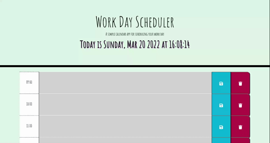

## Work Day Planner

A simple work day planner built using jQuery, Javascript, Bootstrap, HTML and CSS to help keep you ontop of your daily tasks.

This app makes use of localStorage to set and get memos/task list and moment.js to help keep you on track and on time.

During this project, I learned how to integrate external libraries/third-party API's to help navigate the DOM and assist with a consistent style across the various elements in the page.

## Usage

View deployed application on GitHub Pages

Link to the [GitHub Repo](https://github.com/jazzberriess/wk-5-work-day-scheduler)

Built using HTML, CSS and JavaScript, with the help of jQuery and Bootstrap.

## Demo

## Resources

* [Moment.js Documentation](https://momentjs.com/docs/)

* [Bootstrap Documentation](https://getbootstrap.com/docs/5.1/getting-started/introduction/)

* [jQuery Documentation](https://api.jquery.com/)

* [Stack Overflow: saving data to local storage](https://stackoverflow.com/questions/27707501/saving-form-data-to-local-storage-and-show-it-on-refresh)

* [Stack Overflow](https://stackoverflow.com/)

* [Mozilla Developer Network: MDN Web Docs JavaScript](https://developer.mozilla.org/en-US/docs/Web/JavaScript)

* [Mozilla Developer Network: MDN Web Docs Web API's](https://developer.mozilla.org/en-US/docs/Web/API)

* [W3 Schools](https://www.w3schools.com/js/)

* [Google Fonts](https://fonts.google.com/)

* [Font Awesome](https://fontawesome.com/)

* Class notes and recordings from Week 5

* Fellow classmates, instructor and TA's

* AskBCS

